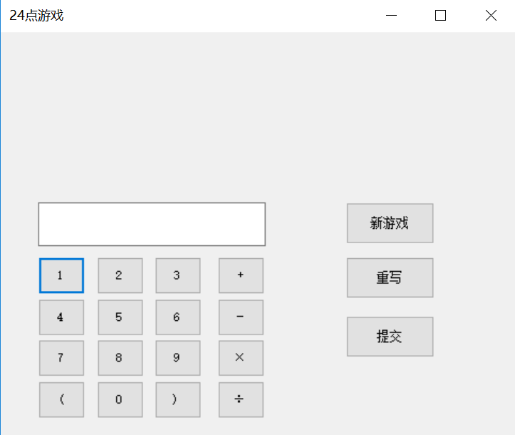
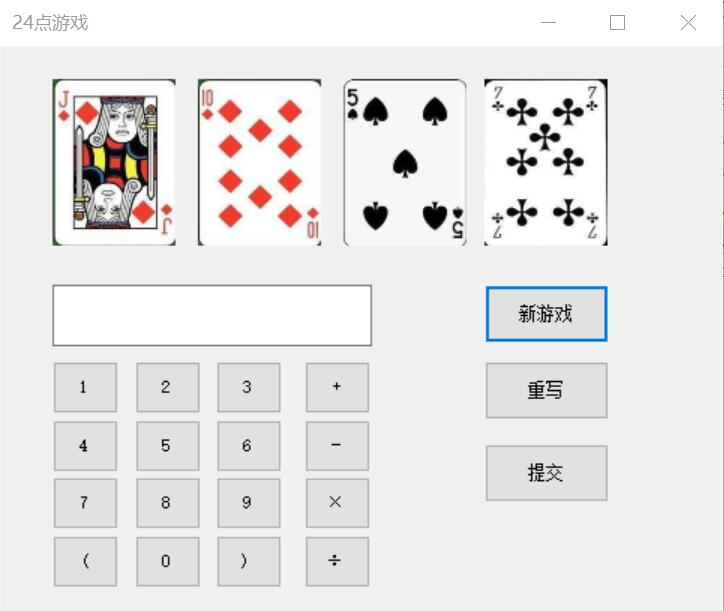
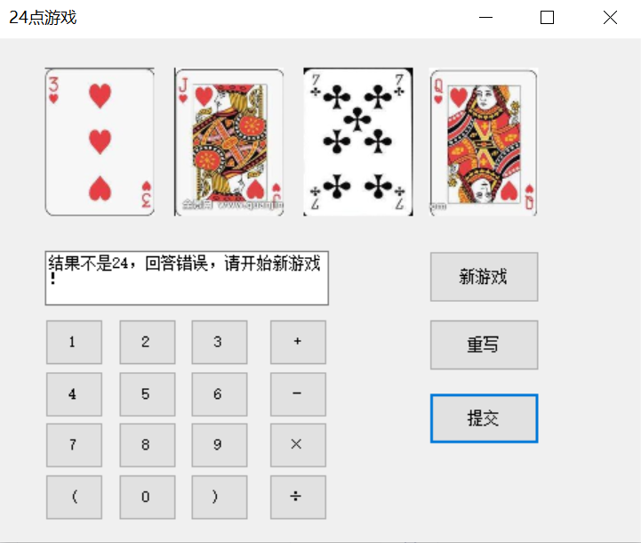

# Five_fish
# U201611851
## Readme document for Demo1 
## 欢迎阅读2048Demo的说明文档

---
### 简介  

这是一个暑期工程实习的实例**Demo**，2048小游戏是这个**Demo**的实现的实际功能。接下来我将对这个**Demo**的相关内容进行说明：

> * 本**Demo**基于CSDN的一位博主的相关思路
> * 图片资源来自互联网
> * 仅作相关学习使用，不得用作商业用途
> * 请在下载后24小时内删除  
  
  


  
    
    
### [Windows程序下载](https://github.com/DesmondXx4/Five_fish/blob/master/Demo1/Debug/Cpp1.exe)


------

## 1.什么是 2048

《2048》，是一款益智小游戏，这款游戏是由年仅19岁的意大利程序员加布里勒希鲁尼（Gabriele Cirulli）开发出来的，官方版本只能在网页上或通过其移动网站运行。

### 2. 本**Demo**的编译环境

- [x] Visual C++ 6.0（都8102年了还有人用这么落后的IDE）
- [x] Graphics.h 库文件（需要下载EasyX图形库）

### 3.2048怎么玩

2048游戏共有16个格子，初始时会有两个格子上安放了两个数字2，每次可以选择上下左右其中一个方向去滑动，每滑动一次，所有的数字方块都会往滑动的方向靠拢外，系统也会在空白的地方随即出现一个数字方块，相同数字的方块在靠拢、相撞时会相加。系统给予的数字方块不是2就是4，玩家要想办法在这小小的16格范围中凑出“2048”这个数字方块。

### 4.新手攻略：

2048这类以数字游戏为原型的游戏是肯定有规律的，新手玩家们不要随意乱移，这款游戏最佳的模式是按照升序或者降序的方式来排列合并，最左上角是最大的格子，其次是次大的，按序列递减，这样的排列效率较高，且省去一些麻烦的思考与计算。

那么我们再来看看如果是自己肆意排列会产生什么样的效果（如下图），在自己随意移动，排列无序的情况下，很容易出现最大数格子位置不稳定，而周围同样的格子也很分散，难以使用，成为白白占用空间而无作用的格子。下图中显示，这样移动一下64在中间，2在左下角，周围的要合并的16，8也难以凑到一起。于是就要另外再合过16，8来合并，这样又造成不必要的浪费。  
  
    
    


### 5. 本Demo操作方式
左移：A键/方向键←  
右移：D键/方向键→  
上移：W键/方向键↑  
下移：S键/方向键↓  
按ESC返回主界面  


```c++
void interact()
{
	char keyboard;
	keyboard = _getch();
	if (keyboard == 'w' || keyboard == 'W' || keyboard == 72)interact_up();//上
	if (keyboard == 's' || keyboard == 'S' || keyboard == 80)interact_down();//下
	if (keyboard == 'a' || keyboard == 'A' || keyboard == 75)interact_left();//左
	if (keyboard == 'd' || keyboard == 'D' || keyboard == 77)interact_right();//右
	if (keyboard == 27)//esc主菜单
	{
		flag = 0;
		setbkcolor(RGB(251, 248, 241));
		start_4();
	}
}
```
> \*请保留此份本**Demo**的欢迎稿兼使用说明，如需提交Bug或相关建议，点击上方工具栏左边侧的**Issues**进行提交

---
玩的开心：）
---
***

# U201611862
## DEMO INSTRUCTION
## 对于程序Calculator的简介
    该程序是借助Visual Studio 2017中C#Windows窗体应用来建立一个简易的计算器，包括加减乘除和清零功能。利用其中的button和textbox控件来完成主界面。
* 开发环境：Visual Studio 2017
* 编程语言：C#
***
## 主界面

***
## 程序代码
### 添加addNum函数
```c
public void addNum(int num)
        {
            textBox1.Text = textBox1.Text + num.ToString();
        }
```
### 利用addNum函数在显示屏中添加数字
```c
//7
        private void button1_Click(object sender, EventArgs e)
        {
            addNum(7);//在显示屏中添加数字7         
        }
```
### 修改运算方式变量
```c
 //除法
        private void button12_Click(object sender,EventArgs e)
        {
            cal = 4;//修改运算标志
            temp1 = Convert.ToInt64(textBox1.Text);//将第一个数设置为前一个数值
            textBox1.Clear();
        }
```       
### 等于号输出结果
```c
//利用switch语句判断运算方式变量
//利用if语句排除除数为0的情况
case 4:
                    if (temp2 == 0)
                    {
                        textBox1.Text = "0不能为除数！请清零后重新输入";
                    }
                    else
                    {
                        textBox1.Text = (temp1 / temp2).ToString();
                    }
                    break;
```
### 归零功能的实现
```c
//归零
        private void button11_Click(object sender,EventArgs e)
        {
            textBox1.Text = "";//显示屏清零
            temp1 = 0;//第一个数清零
            cal = 0;//运算标志清零
        }                   
```
 
***
* 开发者：电气1608班徐圣博
* 开发者联系方式：499853893@qq.com
***
# U201611860
# 24点游戏
## 编程语言：C#
### 电气1608班 王一凡 U201611860

### 玩法介绍
    玩家进入程序后点击新游戏按钮，界面会显示随机四张扑克牌的图片，玩家需要将扑克牌上的数字按照四则运算的法则，点击左下角的按钮输入到文本框中，若写错需要修改则点击重写按钮重新输入，若已完成则点击提交按钮。

    如果玩家算式正确，则文本框文字显示“结果是24，答案正确，恭喜你！”，玩家可以点击新游戏按钮开始下一局游戏。如果玩家算式错误，则文本框文字显示“结果不是24，回答错误，请开始新游戏！”，玩家既可以点击重写按钮重新回答，也可以点击新游戏按钮开始下一轮游戏。

    由于报错太多，本程序取消了输入数字检查的功能，即玩家可以输入非随机到的数字进行游戏，但这样会大大降低游戏体验。

### 游戏页面展示
#### 未开始游戏的主界面

#### 已经开始游戏的主界面

#### 游戏结束界面


### 关键代码展示

```c
//随机生成四个随机数并显示相应的图片
textBox1.Clear();
Random rn1 = new Random();
int[] pork = { 0, 0, 0, 0 };
int k = 0;
int i = 0;
do {
    k = rn1.Next(1, 52);
    if (!pork.Contains(k))
    {
        pork[i] = k;
        i++;
    }
} while (pork[3] == 0);
//上述代码生成四位不重复的随机数
string fname1 = "C:\\2\\WindowsFormsApp1\\WindowsFormsApp1\\Resources\\" + pork[0] + ".jpg";
pictureBox1.Image = Image.FromFile(fname1);
//后三张图片也按照此格式生成
```

```c
//按钮的操作
private void button1_Click_1(object sender, EventArgs e)
    {
        textBox1.Text += "1";
    }
//其他按钮的代码与之类似
```

```C
//执行检验的代码
string ans = textBox1.Text;
MSScriptControl.ScriptControl sc = new MSScriptControl.ScriptControlClass();
sc.Language = "JavaScript";
var b = sc.Eval(ans);
string end = b.ToString();
if (end == "24")
    textBox1.Text = "结果是24，答案正确，恭喜你！";
else
    textBox1.Text = "结果不是24，回答错误，请开始新游戏！";
            
```
***
# U201611850
# 吴心怡的Demo--贪食蛇
## Demo简介
本demo是基于Visual C++的一款简易版贪食蛇游戏
## 玩法介绍
wsad控制蛇

*为蛇，$为食物

每碰到食物则增加节数

空格键暂停
## 程序代码
 

#include <iostream>

#include<conio.h>

#include<time.h>

#include<windows.h>

#define X 15


#define Y 15

int score=0;

char ch[X][Y];

char lch = 's';

char nch = 's';

class Snake

{

public:

Snake() { nx = 8;ny = 8;lx = 9;ly = 9;next = 
NULL; }

Snake(Snake&r);//建立蛇身

void input();//把数据输入到图像

void control();//控制贪吃蛇

void show();//显示图像

void check();//检测食物是否被吃掉

bool gameover();//检测游戏是否结束

int nx;

int ny;

int lx;

int ly;

Snake*next;

};

Snake *head;

namespace Food

{

int x;

int y;

void NEW()

{

Snake*p=head;

x = rand() % X;

y = rand() % Y;

while(p!=NULL)

{

if(p->nx==x&&p->ny==y)

{

x = rand() % X;

y = rand() % Y;

p = head;

}

else

p=p->next;

}

ch[x][y]='$';

}

};

Snake::Snake(Snake&r)

{

this->nx = r.lx;

this->ny = r.ly;

r.next = this;

this->next = NULL;

}

void Snake::show()//显示图像

{

system("cls");

//std::cout << " 
------------------------------ \n";

for (int y = 0; y<Y; ++y)

{

//std::cout << "|";

for (int x = 0; x < X; ++x)

std::cerr << ch[x][y] << " " ;

std::cerr <<"|"<< std::endl;

}

std::cout << " ------------------------------ 
\n";

printf("x = %d,y = %d\n",nx,ny);

printf("x = %0X,y = %0X\n",&nx,&ny);

printf("score = %d\n",score);

}

void Snake::control()//键盘控制

{

if (_kbhit() == 1)

{

nch = _getch();

lx = nx;

ly = ny;

if (nch == 'w' || nch == 's' || nch == 'a' || 
nch == 'd')

{

lch = nch;

switch (nch)

{

case 'w':if (ny == 0) ny = Y - 1; else --ny; 
break;

case 's':if (ny == Y - 1) ny = 0; else ++ny; 
break;

case 'a':if (nx == 0) nx = X - 1; else --nx; 
break;

case 'd':if (nx == X - 1) nx = 0; else ++nx; 
break;

}

}

else

{

switch (lch)

{

case 'w':if (ny == 0) ny = Y - 1; else --ny; 
break;

case 's':if (ny == Y - 1) ny = 0; else ++ny; 
break;

case 'a':if (nx == 0) nx = X - 1; else --nx; 
break;

case 'd':if (nx == X - 1) nx = 0; else ++nx; 
break;

}

}

}

else

{

lx = nx;

ly = ny;

if (nch == 'w' || nch == 's' || nch == 'a' || 
nch == 'd')

{

lch = nch;

switch (nch)

{

case 'w':if (ny == 0) ny = Y - 1; else --ny; 
break;

case 's':if (ny == Y - 1) ny = 0; else ++ny; 
break;

case 'a':if (nx == 0) nx = X - 1; else --nx; 
break;

case 'd':if (nx == X - 1) nx = 0; else ++nx; 
break;

}

}

else

{

switch (lch)

{

case 'w':if (ny == 0) ny = Y - 1; else --ny; 
break;

case 's':if (ny == Y - 1) ny = 0; else ++ny; 
break;

case 'a':if (nx == 0) nx = X - 1; else --nx; 
break;

case 'd':if (nx == X - 1) nx = 0; else ++nx; 
break;

}

}

}

}

void Snake::input()//把对象输入到图像

{

Snake*p = head;

ch[p->lx][p->ly] = ' ';

ch[p->nx][p->ny] = '*';

while (p->next != NULL)

{

p->next->lx = p->next->nx;

p->next->ly = p->next->ny;

p->next->nx = p->lx;

p->next->ny = p->ly;

p = p->next;

ch[p->lx][p->ly] = ' ';

ch[p->nx][p->ny] = '*';

}

}

void Snake::check()//检测食物是否被吃掉

{

Snake*p=head;

if (p->nx == Food::x&&p->ny == Food::y)

{

Snake*p = head;

while (p->next != NULL)

{

p = p->next;

}

p->next = new Snake(*p);

Food::NEW();

++score;

}

}

bool Snake::gameover()//检测游戏是否结束

{

Snake*p = head;

Snake*pn = head->next;

while (p != NULL)

{

while (pn != NULL)

{

if (p->nx == pn->nx&&p->ny == pn->ny)

{

std::cout << "Game Over\n";

return true;

}

pn = pn->next;

}

p = p->next;

}

return 0;

}

int main()

{

//初始化

srand(time(NULL));

for (int y = 0; y<Y; ++y)

for (int x = 0; x<X; ++x)

ch[x][y] = ' ';

head = new Snake;

Food::NEW();

std::cout<<"游戏规则:\n1.wsad(小写)控制蛇\n2.若
蛇节数超过2，那么无法反方向运动，\n若反方向运动则
GameOver\n3.'*'为蛇,'$'为食物\n";

system("pause");

//开始游戏

while (1)

{

head->control();

head->input();

head->check();

if(head->gameover())

break;

head->show();

Sleep(100);
}


Sleep(1000);

system("pause");
return 0;


}

***
# U201611848
# 陈田田的预习Demo——***场地租借***
## **程序功能**
1 记录显示租借者的身份信息    
2 根据不同身份和租用时间计算租金
## **程序开发工具**
Visual C++ 6.0                              

## **程序运行**
### ①代码组成及其功能
1 Time类：设置借出时间和归还时间   
2 Card类：打印租借信息   
3 Teacher类、Student类、Outschool类：card的派生类，计算租金
### ②运行过程
1 输入租借人员身份编号（学生、老师）或姓名（校外人员）及租借起始时间         
2 对应类工作，根据需要显示对应的租借发票   
   


## **C++代码**
#include iostream   
#include iomanip   
#include cstring  
using namespace std;   
class playtime  
{ 
  int hour,minute;   
  public:   
  playtime(int Hour=0,int Minute=0)   
  {hour=Hour;minute=Minute;}//构造函数，给出初始时间    
  void settime(int Hour,int Minute)    
  {hour=Hour;minute=Minute;}//设置时间   
  int get_hour() {return hour;}//获取小时   
  int get_minute() {return minute;}  //获取分钟   
};

class card   
{ public:   
  int ground;    //场地编号    
  playtime borrow_time;  //出借时间   
  playtime return_time; //归还时间   
  int expiry; //借用时间   
  int money;   //标准收费   
  //card() {};//构造函数   
  card(int Ground,playtime Borrow_time,playtime Return_time)     
  {ground=Ground;borrow_time=Borrow_time;return_time=Return_time;}   
  playtime get_borrow_time()    
  {return borrow_time;} //获取出借时间    
  playtime get_return_time()   
  {return return_time;}//获取归还时间   
  int get_ground() {return ground;}   //获取场地编号    
  int get_expiry();//获取借用时间   
  int get_money();
};

int card::get_expiry()   
{ int hb,mb,hr,mr;   
  hb=borrow_time.get_hour();   
  mb=borrow_time.get_minute();   
  hr=return_time.get_hour();   
  mr=return_time.get_minute();   
  expiry=(hr-hb)*60+(mr-mb);   
  return expiry;   
 }  

int card::get_money()    
{ int hb,mb,hr,mr;   
  hb=borrow_time.get_hour();   
  mb=borrow_time.get_minute();   
  hr=return_time.get_hour();   
  mr=return_time.get_minute();   
  expiry=(hr-hb)*60+(mr-mb);   
  if(expiry<=60) {money=50;}   
  else {money=expiry/60*50;}   
  return money;}   

class Teacher: public card//老师   
{ public:   
  char teaNo[30];   
  Teacher(char TeaNo[],int Gro,playtime Borrowt,playtime Returnt): card(Gro,Borrowt,Returnt)   
  {strcpy(teaNo,TeaNo);}   
  void get_No() {cout<<teaNo;}   
};   
class Student: public card//学生   
{ public:   
  char stuNo[30];   
  Student(char StuNo[],int Gro,playtime Borrowt,playtime Returnt): card(Gro,Borrowt,Returnt)   
  {strcpy(stuNo,StuNo);}   
  void get_No() {cout<<stuNo;}   
  
};   
class Outschool:public card//校外人员   
{ public:   
  char name[30];   
  Outschool(char Name[],int Gro,playtime Borrowt,playtime Returnt): card(Gro,Borrowt,Returnt)   
  {strcpy(name,Name);}   
  void get_No() {cout<<name;}   
};   

int main()    
{playtime bt(14,30),rt(16,40);   
 Teacher t("T19950103",3,bt,rt);   
 Student s("U20165534",3,bt,rt);   
 Outschool o("张三",3,bt,rt);   
 card c(3,bt,rt);   
 //以下打印老师发票信息    
 cout<<"老师发票: "<<endl;    
 cout<<"-------------------------------------------------"<<endl;    
 cout<<setw(10)<<'*'<<"场地编号: "<<t.get_ground()<<endl;    
 cout<<setw(10)<<'*'<<"借用者: ";   
 t.get_No();   
 cout<<endl;     
 cout<<setw(10)<<'*'<<"出借时间: "<<bt.get_hour()   <<":"<<bt.get_minute()<<endl;    
 cout<<setw(10)<<'*'<<"归还时间: "<<rt.get_hour()<<":"<<rt.get_minute()<<endl;    
 cout<<setw(10)<<'*'<<"借用时间: "<<t.get_expiry()<<endl;   
 cout<<setw(10)<<'*'<<"租金: "<<(t.get_money())*0.8<<endl;   
 cout<<"--------------------------------------------------"<<endl;    
 //以下打印学生发票信息    
 cout<<"学生发票: "<<endl;    
 cout<<"-------------------------------------------------"<<endl;    
 cout<<setw(10)<<'*'<<"场地编号: "<<s.get_ground()<<endl;    
 cout<<setw(10)<<'*'<<"借用者: ";   
 s.get_No();   
 cout<<endl;     
 cout<<setw(10)<<'*'<<"出借时间: "<<bt.get_hour()   <<":"<<bt.get_minute()<<endl;    
 cout<<setw(10)<<'*'<<"归还时间: "<<rt.get_hour()<<":"<<rt.get_minute()<<endl; 
 cout<<setw(10)<<'*'<<"借用时间: "<<s.get_expiry()<<endl;   
 cout<<setw(10)<<'*'<<"租金: "<<(s.get_money())*0.2<<endl;   
 cout<<"--------------------------------------------------"<<endl;    
 //以下打印校外人员发票信息    
 cout<<"校外人员发票: "<<endl;    
 cout<<"-------------------------------------------------"<<endl;    
 cout<<setw(10)<<'*'<<"场地编号: "<<o.get_ground()<<endl;    
 cout<<setw(10)<<'*'<<"借用者: ";   
 o.get_No();   
 cout<<endl;     
 cout<<setw(10)<<'*'<<"出借时间: "<<bt.get_hour()<<":"<<bt.get_minute()<<endl;    
 cout<<setw(10)<<'*'<<"归还时间: "<<rt.get_hour()<<":"<<rt.get_minute()<<endl;    
 cout<<setw(10)<<'*'<<"借用时间: "<<o.get_expiry()<<endl;   
 cout<<setw(10)<<'*'<<"租金"<<o.get_money()<<endl;   
 cout<<"--------------------------------------------------"<<endl;
 
return 0;
}

