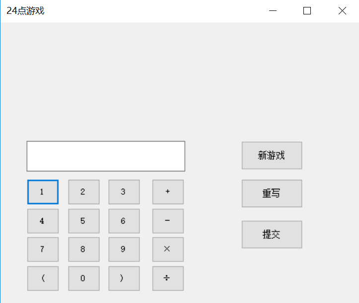
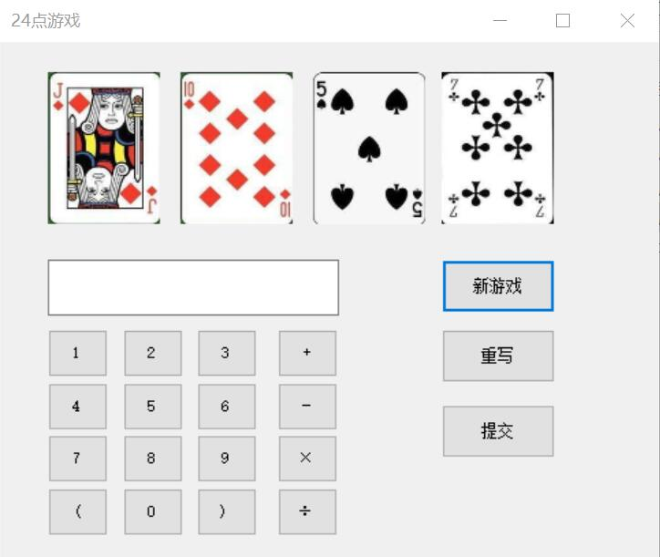

# 24点游戏
## 编程语言：C#
### 电气1608班 王一凡 U201611860

### 玩法介绍
    玩家进入程序后点击新游戏按钮，界面会显示随机四张扑克牌的图片，玩家需要将扑克牌上的数字按照四则运算的法则，点击左下角的按钮输入到文本框中，若写错需要修改则点击重写按钮重新输入，若已完成则点击提交按钮。

    如果玩家算式正确，则文本框文字显示“结果是24，答案正确，恭喜你！”，玩家可以点击新游戏按钮开始下一局游戏。如果玩家算式错误，则文本框文字显示“结果不是24，回答错误，请开始新游戏！”，玩家既可以点击重写按钮重新回答，也可以点击新游戏按钮开始下一轮游戏。

    由于报错太多，本程序取消了输入数字检查的功能，即玩家可以输入非随机到的数字进行游戏，但这样会大大降低游戏体验。

### 游戏页面展示
#### 未开始游戏的主界面

#### 已经开始游戏的主界面

#### 游戏结束界面


### 关键代码展示

```c
//随机生成四个随机数并显示相应的图片
textBox1.Clear();
Random rn1 = new Random();
int[] pork = { 0, 0, 0, 0 };
int k = 0;
int i = 0;
do {
    k = rn1.Next(1, 52);
    if (!pork.Contains(k))
    {
        pork[i] = k;
        i++;
    }
} while (pork[3] == 0);
//上述代码生成四位不重复的随机数
string fname1 = "C:\\2\\WindowsFormsApp1\\WindowsFormsApp1\\Resources\\" + pork[0] + ".jpg";
pictureBox1.Image = Image.FromFile(fname1);
//后三张图片也按照此格式生成
```

```c
//按钮的操作
private void button1_Click_1(object sender, EventArgs e)
    {
        textBox1.Text += "1";
    }
//其他按钮的代码与之类似
```

```C
//执行检验的代码
string ans = textBox1.Text;
MSScriptControl.ScriptControl sc = new MSScriptControl.ScriptControlClass();
sc.Language = "JavaScript";
var b = sc.Eval(ans);
string end = b.ToString();
if (end == "24")
    textBox1.Text = "结果是24，答案正确，恭喜你！";
else
    textBox1.Text = "结果不是24，回答错误，请开始新游戏！";
            
```


